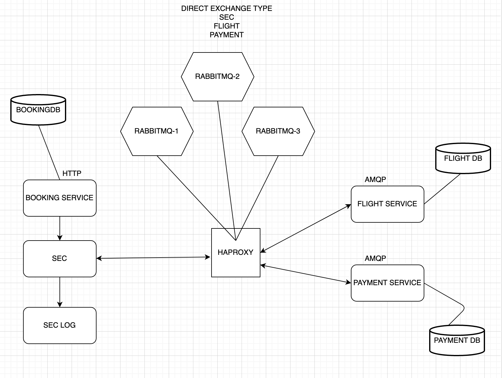

# Saga Pattern: A Comprehensive Demonstration

## General info
Saga pattern is implemented with an orchestrator-based (Saga Execution Coordinator) approach in this project.

This project both demonstrate and illustrate the saga pattern implementation in way of implementing the saga execution coordinator.
	
## Technologies
Project is created with:
* Booking Service - HTTP
* Saga Execution Coordinator - AMQP
* Saga logger - HTTP (web host that serves the sec logs)
* Booking DB - MongoDB
* Flight Service - AMQP
* Flight DB - MongoDB
* Payment Service - AMQP
* Payment DB - MongoDB
* RabbitMQ Cluster - RabbitMQ & HAProxy

## Architectural Design

## Setup
To run this project:

you can run the services separately by following the order below.

1) RabbitMQ Cluster
2) Booking Service
3) Flight Service
4) Payment Service